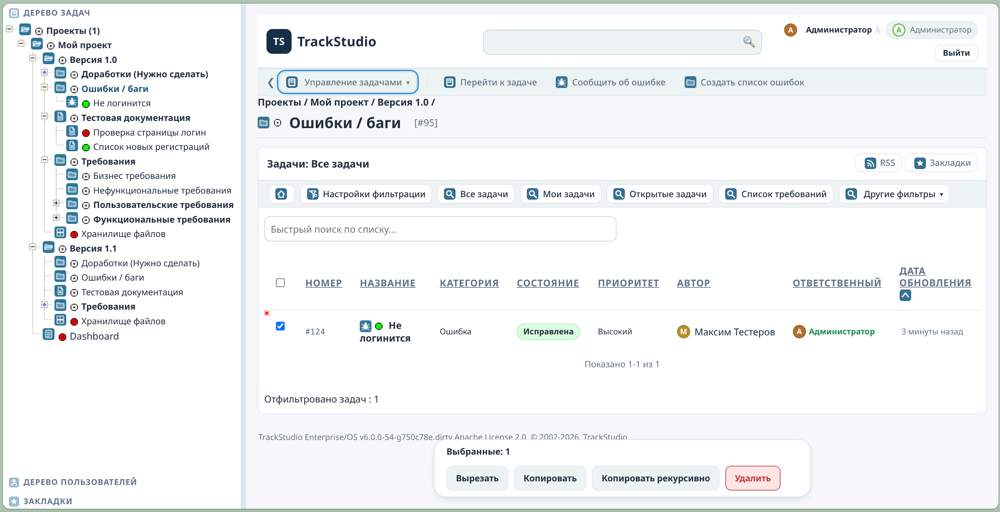

# TrackStudio Enterprise 6 (Open Source)

TrackStudio — это классический трекер задач уровня Enterprise с иерархией задач и пользователей, настраиваемыми рабочими процессами, ролями и правами, SLA-правилами и мощным механизмом уведомлений. Поддерживает сотни тысяч задач и десятки тысяч пользователей на одном сервере.




-   **Лицензия:** Apache License 2.0
    
-   **Стек:** Java 21 / Tomcat 9 / PostgreSQL 17 / Hibernate 5.6 / Lucene / Liquibase / Gradle 9 / Docker & Docker Compose

Подробная документация и руководства будут выкладываться в [вики](https://github.com/maximkr/TrackStudio/wiki). Документация (устаревшая) по TrackStudio 5.5 (коммерческой) находится в папке markdown_ru/markdown_en. 

## ✓ Обзор функций TrackStudio Enterprise

### 1. Иерархическая структура задач и пользователей

TrackStudio позволяет организовывать задачи и пользователей в виде гибкой иерархии — полезно для настройки прав, разграничения доступа и управления проектами на разных уровнях. Например, консалтинговая фирма может ограничить видимость друг друга между клиентами. 

### 2. Гранулярное разграничение прав доступа

Система поддерживает настройку прав просмотра, редактирования и удаления объектов для отдельных пользователей и групп на уровне проектов, задач, полей, обеспечивая гибкий контроль над доступом. 

### 3. Фильтры и отчёты

Вы можете отфильтровать задачи по различным параметрам, а на основе фильтров создавать отчёты в табличном виде. Поддерживается учет отработанных часов.

### 4. Настраиваемые бизнес-процессы

Разные категориии задач могут иметь разные бизнес-процессы, которые гибко настраиваются.

### 5. Оповещения и подписки

Пользователи могут настраивать уведомления по электронной почте для различных событий, а также получать обновления через RSS-каналы. Возможна как рассылка оповещений по событиями, так и периодическая рассылка списков задач по критериям. Гибкая настройка шаблонов оповещения по e-mail. Поддерживается импорт задач и сообщений из почты. 

### 6. Интеграции и API

TrackStudio поддерживает:

-   LDAP
-   REST API

### 7. Расширяемые поля

Поддержка 10 типов дополнительных полей, включая вычисляемые поля и поля со ссылками/обратными ссылками для организации связей между задачами. Можно настроить права доступа даже для каждого поля. 

### 8. Скрипты и автоматизация

Поддерживается Java-подобный язык скриптов (Beanshell) для создания триггеров и автоматизации реакций на события в системе. Поддерживается подключение Java-классов в качестве скриптов. 

### 9. Локализация интерфейса

Поддерживаются русский и английский язык интерфейса, UTF-8, часовой пояс и локаль для каждого пользователя.

----------

## 📦 Быстрый старт (Docker)

Возможна [установка без использования Docker](https://github.com/maximkr/TrackStudio/wiki/%D0%9C%D0%B0%D0%BD%D1%83%D0%B0%D0%BB%D1%8C%D0%BD%D0%B0%D1%8F-%D1%83%D1%81%D1%82%D0%B0%D0%BD%D0%BE%D0%B2%D0%BA%D0%B0)

### 1) Склонируйте репозиторий
```
git clone https://github.com/maximkr/TrackStudio.git 
cd TrackStudio
```
### 2) Создайте файл `.env` с настройками

Создайте файл `.env` в корне проекта:
```bash
# Database configuration
DB_NAME=trackstudio_db
DB_URL=jdbc:postgresql://db:5432/trackstudio_db
DB_USER=trackstudio
DB_PASS=Secure!P@ssw0rd

# Database language for schema initialization
# Values: en (English), ru (Russian)
# Default: en
DB_LANGUAGE=en
```

**Язык схемы базы данных (`DB_LANGUAGE`):**
- `en` — английская версия (по умолчанию)
- `ru` — русская версия

>⚠️ Замените пример пароля на свой надёжный пароль. Файл `.env` лучше не коммитить в VCS.

### 3) Запустите инфраструктуру

```
docker compose up -d --build
```

Поднимутся:

-   `trackstudio-db` — СУБД PostgreSQL
    
-   `migrator` — инициализация базы данных (Liquibase)
    
-   `trackstudio` — само приложение TrackStudio внутри Tomcat
    

----------

## 🚀 Открыть приложение

-   URL: [http://localhost:8080](http://localhost:8080)
    
-   Логин по умолчанию: **root**
    
-   Пароль по умолчанию: **root**
    
> После первого входа **настоятельно рекомендуется** сменить пароль администратора.

----------

## 🔧 Повседневные команды

Остановка:
```
docker compose down
```

Остановка **с удалением базы данных** (все данные будут потеряны!):

```
docker compose down -v
```

Просмотр логов миграций:
```
docker compose logs -f migrator
```

Просмотр логов приложения:
```
docker compose logs -f trackstudio
```

----------

## 🗂️ Что разворачивается

-   **PostgreSQL** — основная СУБД
    
-   **Liquibase** — управляет инициализацией БД
    
-   **Tomcat** — контейнер сервлетов для веб-приложения
    
-   **TrackStudio WAR** — разворачивается в Tomcat
    

----------

## ⚙️ Переменные окружения

Файл `.env` (читается `docker compose`) поддерживает:

|Переменная|Назначение|Пример|
|--|--|--|
|DB_NAME|Имя БД|trackstudio_db|
|DB_URL|JDBC URL|jdbc:postgresql://db:5432/trackstudio_db|
|DB_USER|Имя пользователя|trackstudio|
|DB_PASS|Пароль пользователя БД|StrongP@ss_2025|
|DB_LANGUAGE|Язык схемы БД (en/ru)|en|

> Изменяйте эти параметры до перового запуска приложения. После первого запуска СУБД будет создана и изменить имя базы/пользователя/пароль можно будет только вручную.
 

----------

## 🧪 Проверка готовности

1.  Убедитесь, что контейнеры в состоянии `healthy`/`running`:
    
    `docker compose ps`
2.  Проверьте, что `migrator` завершил выполнение без ошибок:
    
	 `docker compose logs -f migrator`
3.  Откройте в браузере: [http://localhost:8080](http://localhost:8080)
    

----------

## 🩺 Траблшутинг

-   **Порт 8080 занят.**  
    Измените публикацию порта в `docker-compose.yml` (например, `8081:8080`) и откройте `http://localhost:8081`.
    
-   **Не проходят миграции (Liquibase).**  
     Проверьте логи `migrator`:
     `docker compose logs -f migrator`

    
    Убедитесь, что пароль БД корректен (`DB_PASS`), контейнер `trackstudio-db` стартовал, а сеть между контейнерами доступна.
    
-   **Не удаётся войти под root/root.**  
    Проверьте логи приложения:
    `docker compose logs -f trackstudio` 
    
    Убедитесь, что миграции прошли успешно и приложение доступно по правильному URL.
    
-   **Нужно “начать с чистого листа”.**  
    Остановите и удалите тома БД:
    ```
    docker compose down -v
    docker compose up -d --build
    ```
    

----------

## 🧑‍💻 Вклад в проект

Мы приветствуем pull-request’ы и issue с предложениями и баг-репортами:

1.  Форкните репозиторий.
    
2.  Создайте ветку фичи: `git checkout -b feature/awesome-thing`.
    
3.  Коммиты с понятными сообщениями.
    
4.  PR в `main` с описанием изменений и шагами для проверки.

По всем вопросам пишите: Максим Крамаренко <maximkr@gmail.com>
    

----------

## 🔐 Безопасность

-   Не публикуйте реальные пароли в публичных репозиториях и логах.
    
-   Меняйте дефолтные креды **root/root** сразу после первого входа.
    
-   Для продакшена используйте отдельные секреты (Docker/Swarm/K8s), изолированные сети и бэкапы БД.
    

----------

## 📜 Лицензия

Исходный код распространяется по лицензии **Apache License 2.0**.  
См. файл `LICENSE` в корне репозитория.

----------

## 🙌 Благодарности

Спасибо всем контрибьюторам и пользователям TrackStudio за идеи, отчёты об ошибках и развитие продукта.
